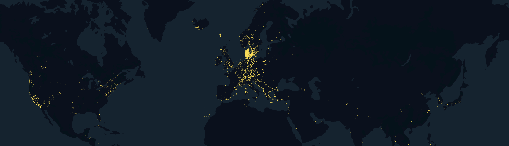

# Masked Location Prediction using Transformers
Implementation of MOBERT - a BERT adaptation for human mobility modelling.




```

├── data-preprocessing-notebooks       <- Notebooks used for data preprocessing (section 4.2) visualisation 
├── figures                            <- All figures used in the thesis
├── model
│   ├── notebooks                      <- Intermediate data that has been transformed.
│   ├── saved_models                   <- All trained models (chapter 7 & 8)
│   ├── baseline.py                    <- The implementation of the baseline models (chapter 7 & 8)
│   ├── build_dataset.py               <- Class that extends torch.utils.data.Dataset class, contains functions connected to the creation of the dataset
│   ├── BERT.py                        <- All trained models (chapter 7 & 8)

├── data
│   ├── external       <- Data from third party sources.
│   ├── interim        <- Intermediate data that has been transformed.
│   ├── processed      <- The final, canonical data sets for modeling.
│   └── raw            <- The original, immutable data dump.
│
                       generated with `pip freeze > requirements.txt`
```


Abstract

Understanding, modeling, and predicting human mobility in urban areas is an essential task for various domains such as transportation modelling, disaster risk management, and infectious disease spreading. In this thesis, we introduce a custom BERT­based model, MOBERT, designed for human mobility modelling. Trained and tested on a pro­ cessed dataset derived from the Copenhagen Network Study, which captures location data from smartphones of 840 individuals, MOBERT effectively predicts masked loca­ tions, outperforming three baseline models and achieving superior results compared to existing­next location prediction approaches. Our analysis of the impact of additional features, including user ID, time, and location rank, on prediction accuracy showed no significant improvements. Furthermore, we evaluated the model’s performance across different grid sizes and location types, emphasizing its proficiency in learning individual­ specific regular patterns while highlighting challenges with explorative mobility patterns. Further limitations include the difficulty in comparing our results with other studies due to the different datasets used across studies and our bidirectional approach, which dif­ fers from the one­directional next location prediction task. We suggest future research focus on further parameter optimization, employing more comprehensive datasets, and fine­tuning to a next location prediction task. Furthermore, enhancing privacy while main­ taining utility remains a critical area for future exploration.


